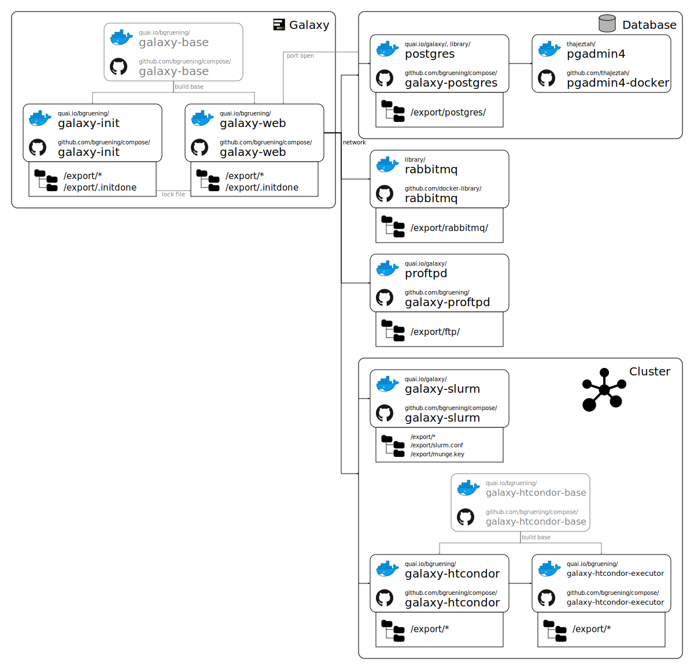

[](https://zenodo.org/badge/latestdoi/5466/bgruening/docker-galaxy-stable)
[](https://travis-ci.org/bgruening/docker-galaxy-stable)
[](https://quay.io/repository/bgruening/galaxy)
[](https://gitter.im/bgruening/docker-galaxy-stable?utm_source=badge&utm_medium=badge&utm_campaign=pr-badge)
 

Galaxy Docker Compose
=====================

# Table of Contents <a name="toc" />

- [Usage](#Usage)
    - [Build](#Build)
    - [Start Container](#Start)
    - [Stop Container](#Stop)
    - [Docker Swarm](#Swarm)
- [Advanced](#Advanced)
  - [postgres](#postgres)
    - [Configuration](#postgres-Configuration)
  - [proftpd](#proftpd)
    - [Configuration](#proftpd-Configuration)
  - [slurm](#slurm)
    - [Configuration](#slurm-Configuration)
  - [galaxy-init](#galaxy-init)
    - [Configuration](#galaxy-init-Configuration)

<p align="right"><a href="#toc">&#x25B2; back to top</a></p>

# Architectural Overview




# Usage <a name="Usage" />

At first you need to install docker with [compose](https://docs.docker.com/compose).
- [docker](https://docs.docker.com/installation/)
- [docker-compose](https://docs.docker.com/compose/install/)

<p align="right"><a href="#toc">&#x25B2; back to top</a></p>

## Build <a name="Build" />

Clone the repository:
```
git clone https://github.com/bgruening/docker-galaxy-stable.git
cd docker-galaxy-stable/compose
```

Build the compose containers:
```sh
./build-orchestration-images.sh --no-push --condor --grafana --slurm --k8s
source ./tags-for-compose-to-source.sh
```

<p align="right"><a href="#toc">&#x25B2; back to top</a></p>

## Start Container <a name="Start" />

After successful installation you can start your composed Galaxy version with:
```sh
docker-compose up -d
```

This will start a bunch of different containers, everyone with a special function.
For example `docker-compose ps` will show you something similar than this:

```
quay.io/galaxy/slurm                       "/usr/bin/startup.sh"  galaxy-slurm
thajeztah/pgadmin4                         "python ./usr/loca..." pgadmin4
quay.io/galaxy/proftpd                     "/usr/bin/run.sh"      galaxy-proftpd
quay.io/bgruening/galaxy-htcondor          "/usr/bin/supervisord" galaxy-htcondor
quay.io/bgruening/galaxy-htcondor-executor "/usr/bin/startup.sh"  compose_galaxy-htcondor-executor_1
quay.io/bgruening/galaxy-htcondor-executor "/usr/bin/startup.sh"  compose_galaxy-htcondor-executor-big_1
quay.io/bgruening/galaxy-init              "/usr/bin/startup"     galaxy-init
rabbitmq:alpine                            "docker-entrypoint..." galaxy-rabbitmq
quay.io/bgruening/galaxy-web               "/usr/bin/startup"     galaxy-web
quay.io/galaxy/postgres                    "docker-entrypoint..." galaxy-postgres
```

As you can see we have started a PostgreSQL and a ProFTP container for you. But also a pgadmin container for administrators that which to inspect the Galaxy database or for Admin trainings. The `galaxy-web` container contains
main Galaxy application and the `nginx` webserver. It is also connected to the an external volume to store all data
that Galaxy generates and all it's configuration - pretty much like the Monolithic Galaxy Docker Image.

SLURM and HTCondor is also started for you and Galaxy can make use of these schedulers. By default Galaxy will use
SLURM as scheduler and will resolve your tool dependencies with Conda. This is all defined in the docker-compose.yml file.
To change the default behavior you can simply export a few environment variables and completely change the behavior of
your composed deployment. For your convenience we will maintain a few recommend deployments as predefinded
environment files, e.g. `.env_htcondor_docker` or `.env_slurm`.
Simply create a symlink to `.env`

```sh
   ln -sf .env_htcondor_docker .env
```

and start your composed Galaxy as you are used to with:

```sh
docker-compose up -d

```

If you have `.env_htcondor_docker` enabled this means Galaxy will use HTCondor as scheduler by default and
even better Galaxy will resolve tool dependencies via BioContainers, so every job on it's own will run in a container.

You want to scale-up your environment and add new workers? Simply start new HTCondor clients with:

```sh
docker-compose scale galaxy-htcondor-executor=5
```


An important feature of the compose version is that you can orchestrates and schedule this entire infrastructure via [Swarm](https://docs.docker.com/engine/swarm), [Kubernetes](https://kubernetes.io) or [Rancher](http://rancher.com/rancher-os).

More documentation will follow. Contributions welcome!

<p align="right"><a href="#toc">&#x25B2; back to top</a></p>

## Stop Container <a name="Stop" />

You want to stop your environment with:

```sh
docker-compose stop
```

<p align="right"><a href="#toc">&#x25B2; back to top</a></p>

# Docker Swarm <a name="Swarm" />

Docker swarm does not yet support reading the .env files. But we can use them by starting Docker swarm in the following way:

```sh
 env $(cat .env | grep ^[A-Z] | xargs) docker stack deploy --compose-file docker-compose.yml galaxy
```

The `galaxy` at the end is the name of the swarm stack. You will see this reference in the following commands as well, so make sure that if you change it here, you adopt it
in the following commands as well.

If your containers are starting but are failing internally you can look at the logs with:

```
docker service logs galaxy_galaxy-web -f
```

If your container is not starting at all, for example because some bind mounts are missing, you can get an indication what happens with:
```
docker stack ps  galaxy --no-trunc
```


<p align="right"><a href="#toc">&#x25B2; back to top</a></p>

# Advanced <a name="Advanced" />

## postgres <a name="postgres" />
You can theoretically use any external database. The included postgres build is based on the [official postgres container](https://hub.docker.com/_/postgres/) and adds an initialization script which loads a vanilla dump of the initial database state on first startup which is faster than initializing by the migration script.

In case you want to generate an initial database dump yourself:
```sh
./dumpsql.sh
./buildlocal.sh
```

To manually initialize a database without the dump connected via docker-compose.yml, before starting the galaxy container you can run:
```sh
docker-compose run galaxy-web install_db.sh
```
which will perform database migration.

### Updating
To update the database to a new migration level, run 
```sh
docker-compose run galaxy-web install_db.sh
```
<p align="right"><a href="#toc">&#x25B2; back to top</a></p>

### Configuration <a name="postgres-Configuration" />
See [official postgres container](https://hub.docker.com/_/postgres/).

## proftpd <a name="proftpd" />

Proftpd uses the [ansible galaxy extras project](https://github.com/galaxyproject/ansible-galaxy-extras) to configurate proftpd. Remark: The proftp server is configured to only allow uploads of new files, as it is not supposed to be used as a file sharing server.
<p align="right"><a href="#toc">&#x25B2; back to top</a></p>

### Configuration <a name="proftpd-Configuration" />

- *proftpd\_db\_connection*=_database@host_: Configurates the database name and hostname. Hostname can be a linked database container.
- *proftpd\_db\_username*=_dbuser_: User in the database.
- *proftpd\_db\_password*=_dbpass_: Password of the user in the database.
- *proftpd\_files\_dir*=_/export/ftp_: Directory where the user files are to be placed. Should be synchronized with volumes.
- *proftpd\_sql\_auth\_type*=_SHA1_: Authentication type used in the galaxy database (SHA1|PBKDF2).
- *proftpd\_welcome*=_Public Galaxy FTP_: Welcome message.
- *proftpd\_passive\_port\_low*=_30000_, *proftpd\_passive\_port\_high*=_40000_: Passive mode port range. This should be kept small for docker exposing the range (30000-30010 or so), because docker allocates each port separately which makes the process stale. Should be same as exposed ports.
- *proftpd\_use\_sftp*=_false_: Enable sftp.
- *proftpd\_nat\_masquerade*=_false_: Set masquearade to true if host is NAT'ed.
- *proftpd\_masquerade\_address*=_ip_: Refers to the ip that clients use to establish an ftp connection. Can be a command that returns an IP or an IP address and applies only if proftpd\_nat\_masquerade is true. `\`ec2metadata --public-ipv4\`` returns the public ip for amazon's ec2 service.

<p align="right"><a href="#toc">&#x25B2; back to top</a></p>

## slurm <a name="slurm" />

The slurm container is an example of how to use an external slurm cluster. The container is set up with a pre-installed virtual python environment ready for galaxy. The default galaxy job_conf.xml is compatible with this container, but will require change for your own external cluster or a more advanced setup.
<p align="right"><a href="#toc">&#x25B2; back to top</a></p>

### Configuration <a name="slurm-Configuration" /> 
See [Running jobs outside of the container](https://github.com/bgruening/docker-galaxy-stable/blob/master/docs/Running_jobs_outside_of_the_container.md) and [Using an external Slurm cluster](https://github.com/bgruening/docker-galaxy-stable#using-an-external-slurm-cluster--toc).
<p align="right"><a href="#toc">&#x25B2; back to top</a></p>

## galaxy-init <a name="galaxy-init" /> 

This container is required to initialize the /export directory structure of the galaxy worker.
On startup, this container will copy all missing directories to /export. In order to update galaxy, simply delete /export/galaxy-central and it will be reinitialized with the current version.
When initialization is complete, this container notifies the galaxy handlers to start up by locking /export/.initdone. You can disable this mechanism by setting DISABLE_SLEEPLOCK=true.
<p align="right"><a href="#toc">&#x25B2; back to top</a></p>

### Configuration <a name="galaxy-init-Configuration" />
- *DISABLE\_SLEEPLOCK*="": Disable sleeplock mechanism.

<p align="right"><a href="#toc">&#x25B2; back to top</a></p>

## galaxy-web <a name="galaxy-web" />

This container runs the actual webhandler.
As of now, this container also runs nginx, job handlers, cron, docker.
This container will wait until it is notified via the lock on /export/.initdone. You can disable this mechanism by setting NONUSE=sleeplock.
<p align="right"><a href="#toc">&#x25B2; back to top</a></p>

### Configuration <a name="galaxy-web-Configuration" />

`/export/` directory structure:
- `galaxy-central/`: Main directory containing the galaxy installation. Configurations and data are symlinked to their export directories.
- `.distribution_config/`: Contains the most current example configuration files (useful for updating/comparing to current configuration in `config/`)
- `config/`: Configuration files for galaxy (symlink from `galaxy-central/config`)
- `database/`: Database directory (symlink from `galaxy-central/database`)
- `display_applications/`: App storage (symlink from `galaxy-central/display_applications`)
- `tool-data/`: Data for tools (symlink from `galaxy-central/tool-data`)
- `tools/`: Tools storage (symlink from `galaxy-central/tools`)

- `ftp/`: Storage for ftp uploads (see [proftpd](#proftpd))
- `nginx_upload_store/`: Temporary upload store for upload from web (required for large uploads)
- `shed_tools/`: Data for shed tools
- `tool_deps/`: Dependencies for tools
- `venv/`: The python virtual environment for galaxy and all jobs
- `welcome/`: Contains files for the welcome page (static content)

- `.initdone`: Lockfile for galaxy-init and galaxy-web synchronization (see *DISABLE\_SLEEPLOCK*)
- `var/`: In case docker is made available, it will be mounted here (TODO)
- `munge.key`: Munge key for slurm
- `slurm.conf`: Configuration for slurm

TODO: Configuration Variables

